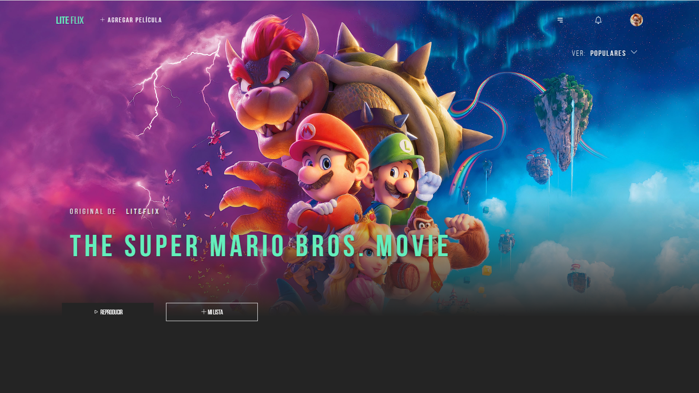
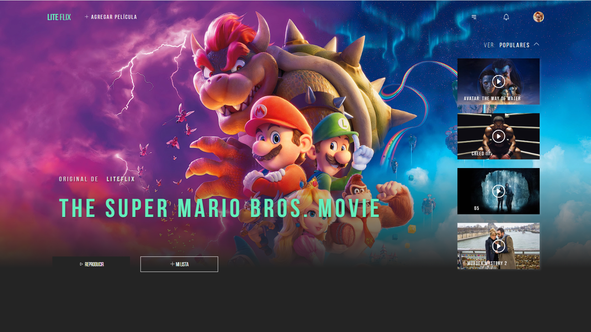
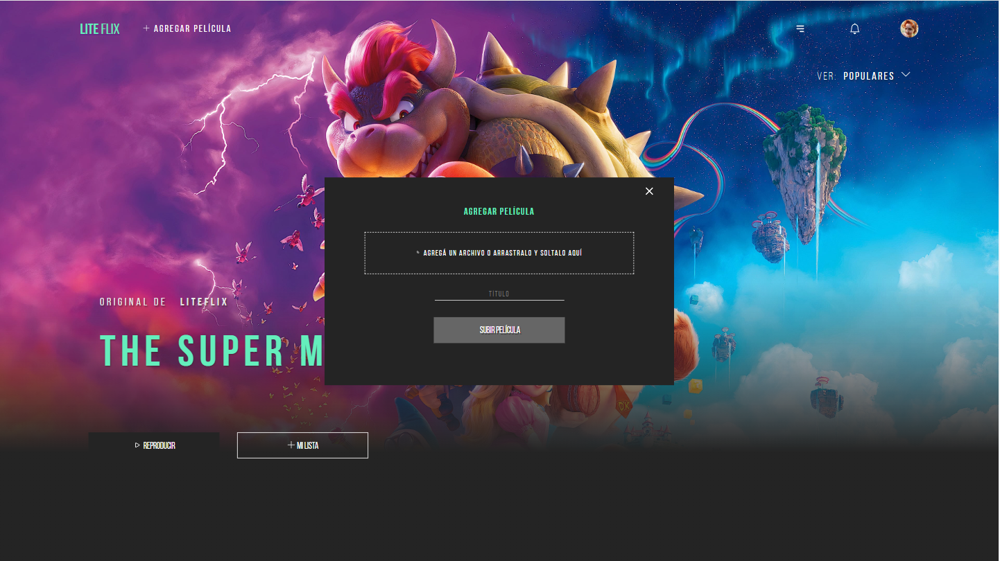
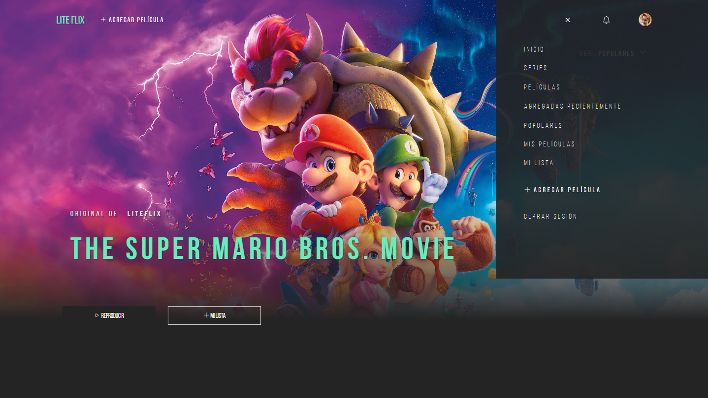
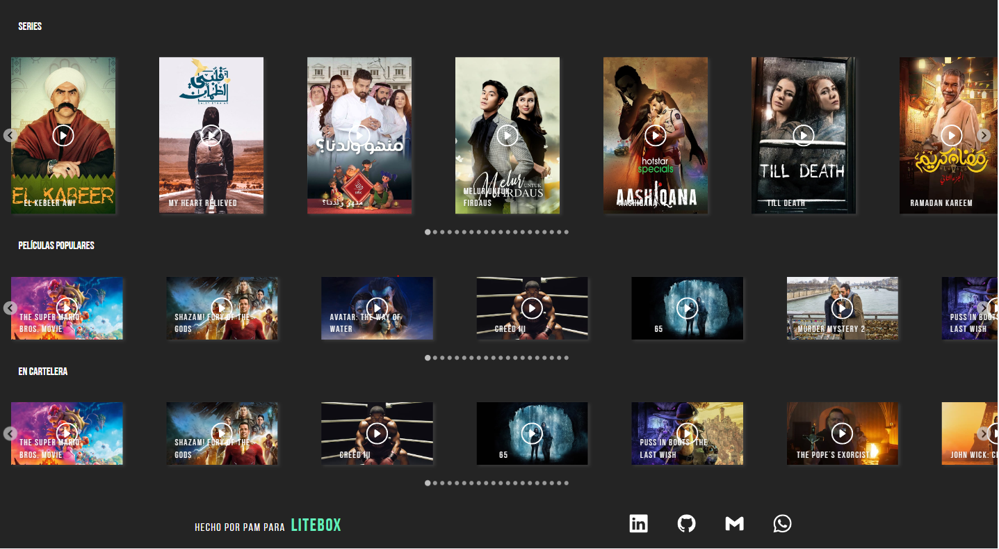
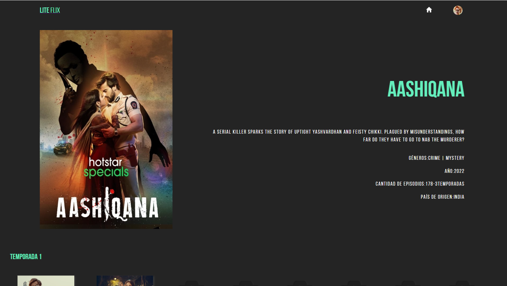
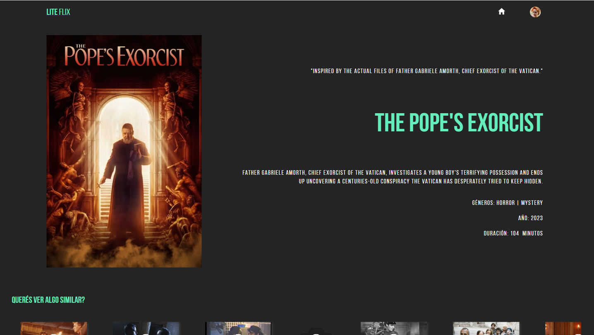

# Liteflix

Challenge project for Litebox.


## Installation

This is a nextJS project, so all you have to do is clone it and then,

```bash
     npm i
     npm run dev
```

And done! you have it all set.

Word of advice, though! some packages are a bit fussy so if the app asks you to install with legacy-peer-deps, just do it. It seems to be something regarding MUI.
            
## Tech Stack

NextJS, Axios, Eslint, Styled Components, TypeScript, Helmet, and more!

The idea was to use a modern and scalable stack, so I chose NextJS, the best way to navigate in a react app. The app is as strongly typed as possible, Styled Components makes the styling so much neater (though my all times favorite is still Sass), and Axios is very flexible and can be modified to add headers or connect to a backend. Helmet is always nice to protect the app, even if in this case there aren't that many risks, and Eslint... well, it can get a bit in your face sometimes, but it makes sure the writing stays consistent!

Regarding MUI... it's actually curious, as I didn't install it because of its visual styles, but rather because it helped with the provider I was building. I tried to use it for the animations, but found React-animations a lot better in the long run.

## Features

- Fully configured linter.
- Services separated in an unified folder so they could be edited at any time.
- Details screens for movies and series, complete with a fully functional navigation.
- Error handling for said screens.
- A fully customized progress bar, with features such as: adding files, removing them, saving to localStorage.
- Shared info saved to context.
- Interfaces for shared data.
- Reusable components for ease of scalability.
- And more!

## Which screen sizes was this tested on?

I tried to test it in the most common screen sizes, so it should work on:

|       width       |      height       |
|-------------------|-------------------|
|       1920        |       1080        |
|       1536        |        864        |
|       1366        |        768        |
|       1280        |        720        |
|       1024        |        600        |
|        600        |        800        |
|        412        |        915        |
|        393        |        873        |
|        360        |        800        |
|        360        |        780        |
|        360        |        640        |

## App screenshots:

1920 x 1080: 









## What's to come?

If time is on my side... a lot! 
- A node backend, so real users can be created, and the custom movies can be stored in a DB.
- Save to favorites, clicking on a heart icon, and of course, also removing them!
- Languages! i18n seems to be trickier on nextJS than it is on React.
- Infinite click on thumbnails: for now it works only for the main screens, but it should work for the recommended series and movies too!
- Series episodes separated by seasons.
- User profiles.
- Testing! oh god, so much to test, so little time.
- accesibility!